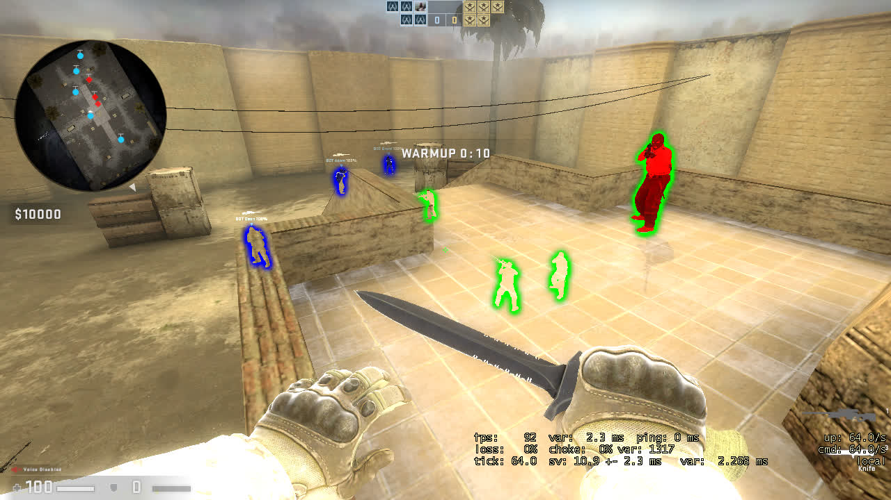

# CS2 Hacks - External CS2 cheats




### Story
I've played CS2 (CSGO) for 3 whole years and claim the service medals and let me tell you that CS is filled with cheaters.

There was a game I've played against a team which had 3 spinner hacks on 15 year old accounts and was Global Elites.

I searched and found too many hacks which a lot of them claimed to be undetected by VAC and It's just a market for software. (Visit: [unknowncheats.me](https://unknowncheats.me/forum))

While we do enjoy the game without any hacks and with pure skill
 but CS does not worth playing (without hacks) because its full of it!
 so dont be a "GOOD GUY" and talk people out of it as long as Valve does not want to do something serious about it!

Since then I recommend at least play on more strict platforms like [FaceIt](https://www.faceit.com/en).

---
### Disclaimer
**You might get reports and VAC ban for using this software in online or even offline games. So Use it on your own risk**

Do not use this in online games because it does ruin people gameplay and time (which is most valuable resource of ours BTW) and also the fun out of the game.
use it only for educational purposes and learn programming and knowledege that online gaming does not worth your time of life :)

also try and report it to valve may they fix their shitty anticheat and hardening their restrictions on BANs.

_Guide: If you want to just test the software launch CS2 with `-insecure` launch option and play in non VAC servers._


---
### Contribution
All contributions are welcome, pull request your code ♥

To report problems, post ideas or requesting a feature make an issue.


---
### How to run
1. run latest version of CS2.

*Windows:* Its just easier to open solution in Visual Studio and run it!

but this project also supports CMake so you can use that too:

```bash
git clone https://github.com/ainyava/cs2-hacks
cd cs2-hacks/
mkdir build
cd build
cmake ../
cmake --build .
```
